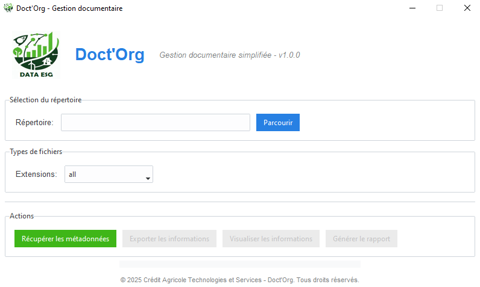

# Doct'Org - Gestion Documentaire Simplifiée

Bienvenue dans **Doct'Org**, un outil intuitif et puissant conçu pour simplifier la gestion de vos documents numériques. Que vous soyez un professionnel ou un particulier, **Doct'Org** vous aide à organiser, analyser et extraire des métadonnées de vos fichiers en quelques clics.

---

## 🎯 **Objectif de l'outil**

**Doct'Org** a été conçu pour répondre aux besoins suivants :
- **Centralisation** : Parcourez un répertoire et analysez tous les fichiers qu'il contient.
- **Extraction de métadonnées** : Récupérez des informations clés comme le nom du fichier, le type, l'auteur, la date de dernière modification, et plus encore.
- **Organisation** : Déplacez facilement vos fichiers vers des répertoires spécifiques.
- **Rapports** : Générez des rapports détaillés au format CSV pour un suivi ou une analyse ultérieure.

---

## ✨ **Fonctionnalités principales**

### 1. **Extraction de métadonnées**
- Analysez un répertoire pour extraire des informations sur vos fichiers.
- Prend en charge une large gamme de formats de fichiers :
  - Documents : `.docx`, `.pdf`, `.txt`, `.csv`
  - Images : `.jpg`, `.jpeg`, `.png`
  - Tableurs : `.xlsx`, `.xls`
  - Présentations : `.pptx`, `.ppt`
  - Archives : `.zip`, `.rar`

### 2. **Visualisation des informations**
- Affichez les métadonnées extraites dans une interface conviviale.
- Triez et explorez les données directement dans l'application.

### 3. **Exportation des données**
- Exportez les métadonnées extraites au format CSV pour une utilisation dans d'autres outils (Excel, Google Sheets, etc.).

### 4. **Organisation des fichiers**
- Déplacez facilement les fichiers sélectionnés vers un répertoire de destination.
- Suivez les fichiers déplacés grâce à un historique intégré.

### 5. **Génération de rapports**
- Créez des rapports détaillés sur les fichiers déplacés, incluant des informations comme le chemin source et destination.
- Exportez ces rapports au format CSV.

---

## 🖥️ **Interface utilisateur**

L'interface de **Doct'Org** est conçue pour être simple et intuitive :
1. **Sélection du répertoire** : Choisissez le dossier à analyser.
2. **Choix des extensions** : Filtrez les fichiers par type (ou analysez tous les fichiers).
3. **Actions** :
   - Récupérer les métadonnées
   - Visualiser les informations
   - Exporter les données
   - Déplacer les fichiers
   - Générer un rapport

---

## 🚀 **Comment utiliser Doct'Org ?**

### Étape 1 : Lancer l'application
1. Double-cliquez sur le fichier `DoctOrg.exe` (disponible dans le dossier `dist` après compilation).
2. L'application s'ouvre avec une interface graphique.

### Étape 2 : Sélectionner un répertoire
1. Cliquez sur le bouton **Parcourir** pour choisir un dossier contenant vos fichiers.

### Étape 3 : Choisir les types de fichiers
1. Sélectionnez une extension spécifique (par exemple `.pdf`) ou choisissez **all** pour analyser tous les fichiers.

### Étape 4 : Récupérer les métadonnées
1. Cliquez sur **Récupérer les métadonnées**.
2. Les informations extraites s'affichent dans l'application.

### Étape 5 : Exporter ou organiser
- **Exporter les informations** : Cliquez sur **Exporter les informations** pour enregistrer les données au format CSV.
- **Déplacer les fichiers** : Sélectionnez les fichiers dans la liste et cliquez sur **Déplacer les fichiers** pour les organiser dans un autre dossier.

### Étape 6 : Générer un rapport
1. Une fois les fichiers déplacés, cliquez sur **Générer le rapport**.
2. Entrez votre identifiant utilisateur (format : `ETXXXXX`) pour personnaliser le rapport.
3. Enregistrez le rapport au format CSV.

## 🛠️ **Installation et configuration**

### Prérequis
- **Système d'exploitation** : Windows 10 ou supérieur.
- **Python** : Si vous utilisez le code source, Python 3.12 ou supérieur est requis.

### Installation
1. Téléchargez l'exécutable `DoctOrg.exe` ou clonez le projet depuis le dépôt GitHub.
2. Si vous utilisez le code source :
   - Installez les dépendances avec `pip install -r requirements.txt`.
   - Lancez l'application avec `python DoctOrg.py`.

---

## 📝 **Notes techniques**

### Technologies utilisées
- **Langage** : Python
- **Interface graphique** : `tkinter` avec `ttkbootstrap`
- **Bibliothèques principales** :
  - `pandas` : Manipulation des données
  - `PyPDF2` : Extraction de métadonnées des fichiers PDF
  - `Pillow` : Gestion des images
  - `openpyxl` : Lecture des fichiers Excel
  - `python-pptx` : Lecture des fichiers PowerPoint

### Structure du projet
- **DoctOrg.py** : Fichier principal contenant l'application.
- **logo_squad_data_ESG.png** : Logo affiché dans l'application.
- **requirements.txt** : Liste des dépendances Python.

---

## 📧 **Support**

Si vous avez des questions ou des problèmes, veuillez contacter l'équipe de support à l'adresse suivante :  
**support@doctorg.com**

---

## 🏆 **Crédits**

- Développé par **Crédit Agricole Technologies et Services**.
- © 2025 Crédit Agricole Technologies et Services - Tous droits réservés.

---

## 🔒 **Mentions légales**

L'utilisation de cet outil est soumise aux conditions générales d'utilisation de **Crédit Agricole Technologies et Services**. Veuillez consulter les termes avant utilisation.